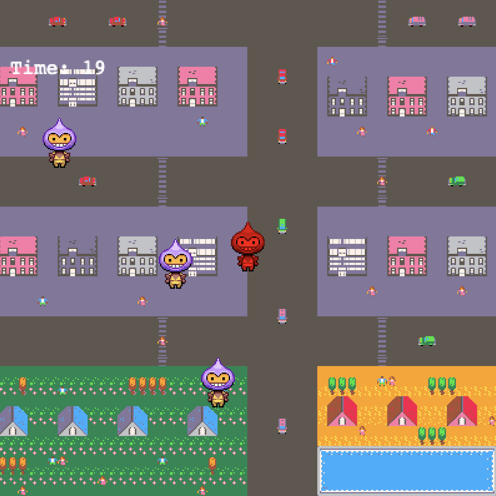

PickPocket Game

PickPocket Game is an intense 2D action game built with Phaser 3. You play as a swift pickpocket with just 30 seconds to rob all NPCs in a pre-designed city map. Move fast, avoid lingering too long near targets, and escape through the door to advance—or get caught in an explosive failure!

Features
City Map: A tile-based map loaded from city.json, featuring streets, buildings, and collision zones.
Time Pressure: Rob all NPCs within 30 seconds or explode.
Dynamic Movement: Use arrow keys to move, Shift to sprint, and Space to jump.
Stealth Mechanics: Approach NPCs and press E to rob them, but don’t stay too close for over 1 second.
Progressive Stages: Each stage increases the number of NPCs, ramping up the challenge.

How to Play
Controls:
Arrow Keys: Move the player (red sprite).
Shift: Sprint (increases speed to 150).
Space: Jump (short upward hop).
E: Rob an NPC when nearby.

Objective:
Rob all NPCs (gray sprites) within 30 seconds.
Avoid staying within 50 pixels of an NPC for more than 1 second, or you’ll explode.
Once all NPCs are robbed, head to the escape door (center of the map) to proceed to the next stage.
Game Over:
If the 30-second timer runs out or you linger too long near an NPC, you explode, and the game restarts.

Installation
Clone the Repository: git clone git@github.com:brubis13/PickPocket-Game.git
cd PickPocket-Game

Install Dependencies:
Ensure you have Node.js installed.
Install a local server tool like live-server:
npm install -g live-server

Developed by: brubis13
Powered by: Phaser 3